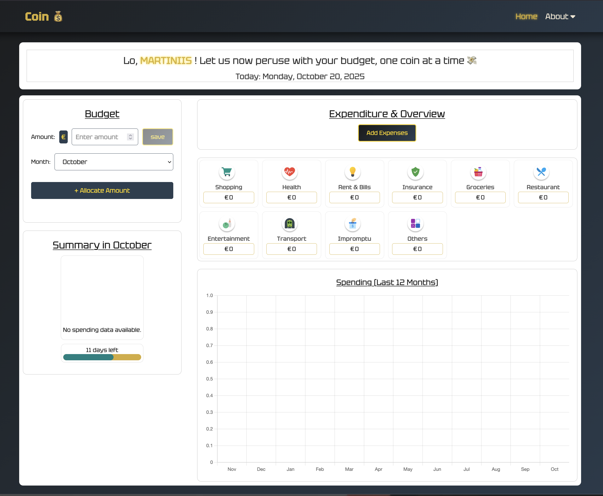
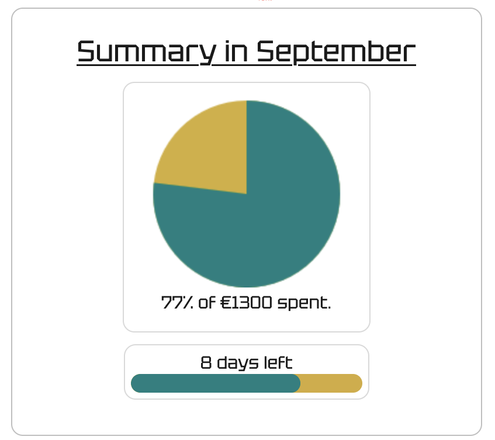

## 💰 Coin Project

A simple user-friendly finance tracker built with HTML, CSS, JavaScript, and PHP. Track income and expenses, assign transactions to categories, set a monthly budget with per‑category allocations, and view visual reports and trends. Includes local user authentication and secure DB access (prepared statements) — no external services required; data stays on your local server. Lightweight and easy to extend for learning and experimentation with full‑stack web development.

## ✨ Features

- **User accounts** — Sign up and log in with local accounts; security questions available for account recovery (no email integration).
- **Password reset** — Recover or reset passwords using configured security questions.
- **Dashboard** — Monthly overview showing total spent, percentage of budget used, top categories, and days remaining in the month.
- **Categories** — Predefined spending categories (e.g., rent, transport). Assign transactions to categories to track category totals.
- **Budget management** — Set a total monthly budget and allocate amounts to categories for more granular tracking.
- **Charts & reports** — Visualize spending with pie charts and historical graphs (e.g., last 12 months) to spot trends and remaining budget.
- **Responsive UI** — Simple, mobile-friendly interface built with HTML, CSS, and JavaScript for a consistent experience across devices.
- **Security & best practices** — Uses prepared statements for safe DB access; sensible defaults to avoid exposing credentials in version control.
- **Extensible design** — Simple structure intended for easy improvement (additional categories, email integration, or richer analytics).

## 🚀 Getting Started

### Prerequisites
- PHP 8+ with mysqli or pdo_mysql enabled  
- MySQL (or MariaDB) server  
- Apache (XAMPP, MAMP, or a similar local server)  
- Web browser (e.g., Firefox, Chrome)  
- Code editor (e.g., VS Code)  
- phpMyAdmin for easier DB visualizations and management

### Running the Project
1. Clone the repository:
	```bash
	git clone https://github.com/martiniisluther/Coin--Project--Budget.git
	```
2. Place the cloned folder inside your local server web root (e.g., /Applications/XAMPP/xamppfiles/htdocs/myapp or C:\xampp\htdocs\myapp).
3. Create and import the database:
	- Create a new database (e.g., coin_project) via phpMyAdmin or MySQL CLI.
	- Import the provided SQL file found in the repo (search for *.sql, e.g., schema.sql or seed.sql).
4. Configure the DB connection:
	- Update the database connection file (php/database.php) with your DB host, name, user, and password.
	- Example variables to update: $host, $user, $password, $database.
5. Start services and open the app:
	- Start Apache and MySQL using XAMPP/MAMP or your chosen stack.
	- Open: http://localhost/myapp/ (or http://localhost/myapp/welcomepage.html)

### Quick Tips & Troubleshooting
- Ensure XAMPP → Manage Servers shows MySQL Database, ProFTPD, and Apache Web Server as Running.
- In php/database.php include the MySQL host and port in $host, e.g.:
	- $host = '127.0.0.1:3307'; // change 3307 to your MySQL port or other host:port as needed
- If you see a connection error, double-check $host, $user, $password, and $database in php/database.php.
- Check the web server/PHP error logs for 500 errors (XAMPP logs or /Applications/XAMPP/xamppfiles/logs/error_log).
- Do not commit real credentials to version control — use environment variables or a local config file excluded by .gitignore.
- After these steps the app should be reachable at the local URL.


### Project Structure

```
project-root/
└── htdocs/
	└── myapp/
		├── welcomepage.html
		├── homepage.php
		├── accountpage.html
		├── css_files/
		│   ├── welcomepage.css
		│   ├── homepage.css
		│   └── accountpage.css
		├── js_files/
		│   ├── welcomepage.js
		│   ├── homepage.js
		│   └── accountpage.js
		├── php/
		│   ├── login.php
		│   ├── signup.php
		│   ├── reset_password.php
		│   ├── logout.php
		│   ├── database.php
		│   ├── budget_operations.php
		│   └── ... (other PHP files)
		├── screenshots/
		│   ├── welcomepage.png
		│   ├── homepage_preview.png
		│   └── summary_month.png
		└── README.md
```


### Website Preview

|  |  |  |
|:--:|:--:|:--:|
| *Welcome page* | *Homepage preview* | *Monthly summary* |


## 🎯 Goals

- Build a complete full‑stack app with PHP + MySQL: secure authentication, CRUD for transactions and budgets, and safe DB access (prepared statements).
- Strengthen frontend skills: responsive layouts, accessible UI, client‑side validation, and interactive charts.
- Improve development workflow: use Git/GitHub with feature branches, meaningful commits, pull requests, and issue tracking.
- Practice deployment and debugging: run locally with XAMPP/MAMP, examine logs, and prepare simple production configuration (env-based credentials).
- Add automated checks: basic unit/integration tests and linting for JS/CSS to catch regressions early.
- Plan future extensions: prototype front‑end frameworks (React/Vue) or consider a server‑side migration (e.g., JSF/Java) if you decide to move off PHP.

Success criteria: a working local app with secure auth, tested CRUD flows, responsive UI, and a documented Git workflow for further contributions.

