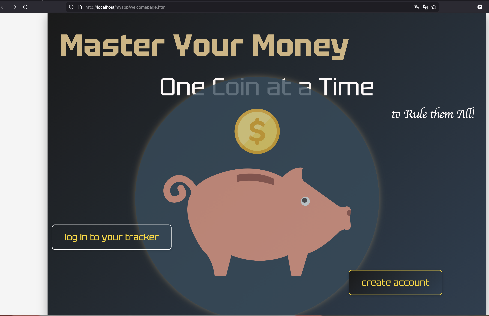
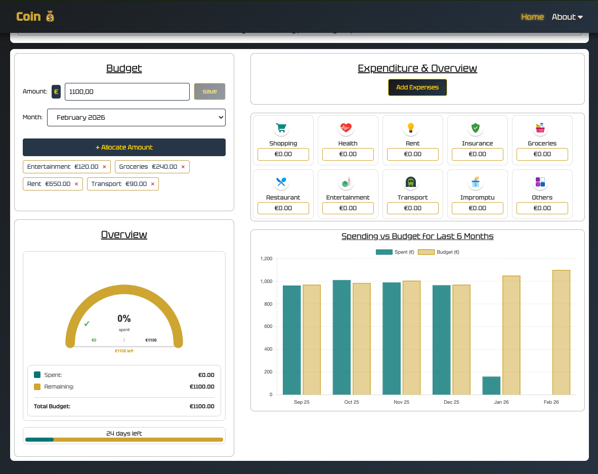
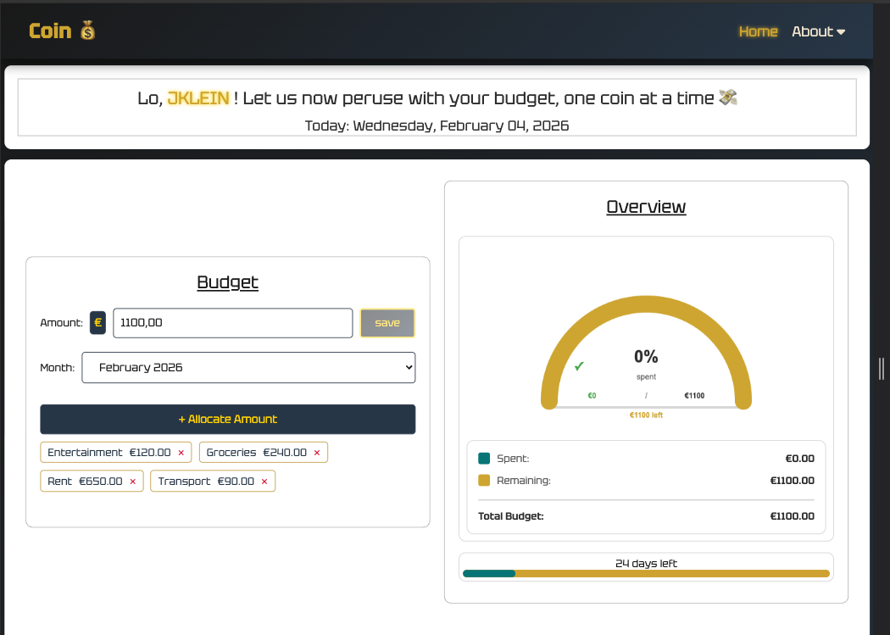
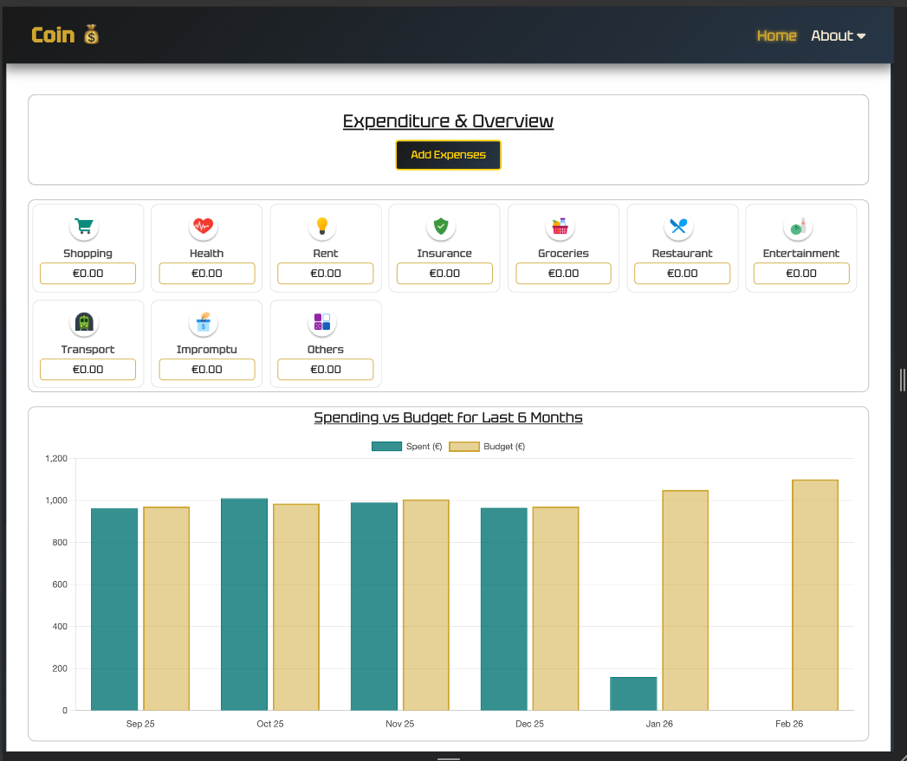

# Coin Project - Budget Management Web Application

## Project Overview
This project is a locally hosted budget management web application developed as part of the Java & Web Development portfolio course. The aim of the project is to design and implement a complete full-stack web application that allows users to manage personal budgets, record expenses, and visualize spending patterns over time.

The application focuses on practical web development concepts, including frontend user interface design, backend logic, database interaction, and secure handling of user data. All data is stored locally, and no external services or APIs are required.


## Purpose and Goals

**Functional Goal:**
Provide users with a simple and intuitive way to define monthly budgets, allocate funds to predefined categories, record expenses, and review spending summaries using visual charts.

**Learning Goal:**
Gain hands-on experience in full-stack web development using PHP and relational databases, while applying best practices such as prepared statements, modular code structure, and version control with GitHub.

**Scope:**
The application is intentionally limited to local execution to keep the focus on core web development concepts rather than deployment or third-party integrations.


## Core Features

- **User authentication** — Supports local user registration and login. Account recovery is handled via security questions rather than email integration.
- **Budget management** — Users can define a total monthly budget via allocation of amounts to predefined categories.
- **Expense tracking** — Expenses can be added per category and are persisted in the database for monthly summaries and historical analysis.
- **Data visualization** — The application provides graphical representations of spending using charts, including monthly summaries and a historical overview of the last six months.
- **Responsive user interface** — The layout adapts to different screen sizes, allowing the application to be used on both desktop and mobile devices.
- **Secure database interaction** — All database operations use prepared statements to reduce the risk of SQL injection and improve overall robustness.


## Technology Stack

**Frontend**
- HTML
- CSS
- JavaScript

**Backend**
- PHP

**Database**
- MySQL or MariaDB

**Development Environment**
- Apache Web Server (via XAMPP, MAMP, or equivalent)
- phpMyAdmin for database inspection and management
- Visual Studio Code or a comparable code editor

> **Note:** XAMPP is used solely as a local development environment and is not considered part of the system architecture.


## Installation and Run Instructions

### Prerequisites

To run the application locally, the following components are required:

- **PHP 8 or higher** with `mysqli` or `pdo_mysql` enabled
- **MySQL or MariaDB** database server
- **Apache Web Server**
- A modern web browser (Google Chrome was used for this project)
- **phpMyAdmin** (recommended for database management)


### Setup Steps

1. Clone the repository:
	```bash
	git clone https://github.com/martiniisluther/Coin--Project--Budget.git
	```

2. Place the project in the web root:
	- **macOS (XAMPP):** `/Applications/XAMPP/xamppfiles/htdocs/myapp` (the project was developed using this option)
	- **Windows (XAMPP):** `C:\xampp\htdocs\myapp`

3. Database initialization:
   - Ensure the MySQL/MariaDB server is running.
   - Open the application in the browser.
   - The database `myCoinApp` will be created automatically (via database.php file) if it does not already exist.

4. Configure database connection:
	4. Configure database connection:
		- Open `php/database.php`
		- Update the database credentials (`$host`, `$user`, `$password`, `$database`)
		- Example configuration for this project:
		  ```php
		  $host = '127.0.0.1:3306'; // port used in this project
		  $user = 'root';
		  $password = '1357987';
		  $database = 'myCoinApp';
		  ```

5. Start the local server:
	- **macOS:** Use the XAMPP Manager to start Apache and MySQL services
	- **Windows:** Use the XAMPP Control Panel to start Apache and MySQL services
	- **Linux:** Start services via command line: `sudo /opt/lampp/lampp start`

6. Access the application by navigating to `http://localhost/myapp`:
	- Open `welcomepage.html`
	- Sign up using the required fields
	- For quick testing, execute `sample_test_users.php` by navigating to `http://localhost/myapp/php/sample_test_users.php` to insert sample test users into the database
	- Log in with the sample credentials in `sample_test_users.php` file and start managing your budget and visualizing spending via the overview and charts


## Project Structure

```
project-root/
└── htdocs/
	└── myapp/
		├── welcomepage.html
		├── homepage.php
		├── accountpage.html
		├── css_files/
		│   ├── welcomepage.css
		│   ├── homepage.css
		│   └── accountpage.css
		├── js_files/
		│   ├── accountpage.js
		│   ├── budget_api.js
		│   ├── charts_controller.js
		│   ├── expenses_api.js
		│   ├── homepage_ui.js
		│   └── welcomepage.js
		├── php/
		│   ├── budget_and_expense_manager.php
		│   ├── database.php
		│   ├── expenses_controller.php
		│   ├── login.php
		│   ├── logout.php
		│   ├── reset_password.php
		│   ├── sample_test_users.php
		│   └── signup.php
		├── screenshots/
		│   ├── welcomepage.png
		│   ├── homepage_preview.png
		│   └── summary_month.png
		├── .gitignore
		└── README.md
```

The codebase is organized by responsibility, separating frontend assets, backend logic, and configuration files to improve readability and maintainability.


## Test Data and Usage

Sample users and test data are provided to facilitate manual testing of the application’s functionality. These datasets were consistently utilized across screenshots, test cases, and screencast demonstrations to ensure reproducibility.

Manual test cases are documented in the presentation slides and include:
- Authentication flows
- Budget creation and updates
- Expense entry and persistence
- Chart updates after data changes
- Responsive layout behavior


## Learning Objectives and Outcomes

This project was designed to achieve the following learning outcomes:

- Apply full-stack web development principles using PHP and relational databases
- Design and implement CRUD operations securely using prepared statements
- Develop responsive user interfaces with HTML, CSS, and JavaScript
- Manage source code using Git and GitHub with meaningful commit history
- Reflect on architectural decisions and iterate based on feedback
- Document installation, usage, and testing procedures clearly

## Future Improvements

Potential enhancements for future iterations include:

- **Receipt-like expense preview** — Display expenses in a formatted receipt layout for better visual context
- **Expense categories expansion** — Allow users to create custom budgeting and spending categories instead of predefined ones
- **Data export functionality** — Enable users to export budget summaries and expense reports in PDF or CSV formats
- **Budget alerts** — Notify users when spending in a category approaches or exceeds the allocated budget
- **Dark mode UI** — Provide a dark theme option for improved accessibility and user preference


### Application Preview

|  |  |  |  |
|:--:|:--:|:--:|:--:|
| *Welcome page* | *Homepage* | *Budget & Overview* | *Expenses & Bar Chart* |


### Development Notes

Some `console.log()` statements are intentionally left commented out in the JavaScript source files. These logs were used during debugging and validation of API responses and UI state changes.

They remain commented (not removed) to support future development and troubleshooting beyond the scope of this project submission. They do not affect runtime behavior, performance, or user experience in the submitted version.


**End**